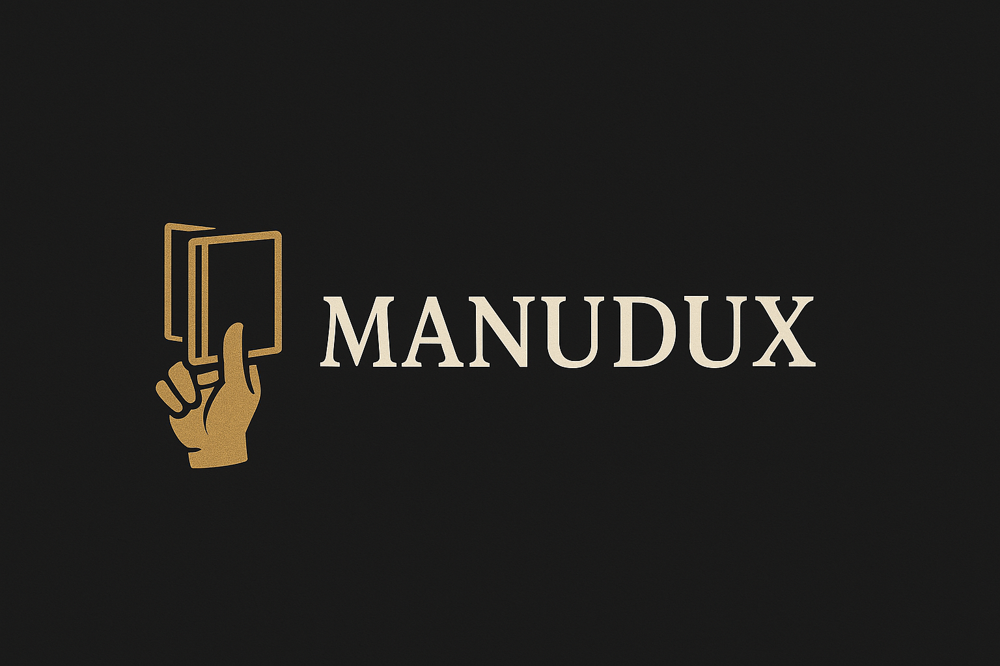

# Manudux

[](https://github.com/JonneSaloranta/manudux/actions/workflows/django-test-ci.yaml)



## What is Manudux?

Manudux name is derived from the Latin words "manus" (hand) and "dux" (leader), which could be translated as "handguide".

Manudux aims to be an easy-to-use tool for managing documentation and maintenance of your properties. It is designed to be used by anyone, regardless of their technical expertise. Manudux is in early stages of development, but is expected to evolve and improve as development progresses.

## Plan

1. **Objectives**:
    - Create a user-friendly tool for managing household or property documentation.
    - Ensure accessibility for users with varying levels of technical expertise.
    - Provide a centralized platform for organizing and accessing important information for everyday use and emergencies.
    - Should be Self-Hostable.

2. **Planned features**:
    **Version v1.0**
    - Maintenance schedules
    - Documentation templates
    - Simple user interface

    **Future versions**
    - Import/Export
    - Automated QR-Code generation for placing easier access to guides.
    - Other auth methods e.g LDAP, OAUTH, SSO

3. **Target Audience**:
    - Homeowners.
    - Property managers.
    - Individuals responsible for property maintenance.

4. **Implementation**:
    - Develop a simple and intuitive user interface.
    - Provide templates for common documentation needs.
    - Enable easy organization and retrieval of documents.

5. **Benefits**:
    - Streamlined documentation process.
    - Improved organization and accessibility of information.
    - Enhanced maintenance and inventory management.

## Development / Deployment(NOT RECOMMENDED!!)

### Environment variables

```yaml
SECRET_KEY=your_django_secret_key_for_manudux # required, no default - generate your own
DEBUG=True # or False, defaults to False if not set
ALLOWED_HOSTS=localhost,192.162.2.10 # or your host
INTERNAL_IPS=*,127.0.0.1,localhost # used in development and testing
TIME_ZONE=UTC # or your timezone. Optional, defaults to UTC if not set
SITE_URL='http://manuxu.example.com' # This is used for links
ALLOW_REGISTRATION=True # allow visitors to sign up
SECURE_SSL_REDIRECT=False # set to True once served over HTTPS
SESSION_COOKIE_SECURE=False # set to True once served over HTTPS
CSRF_COOKIE_SECURE=False # set to True once served over HTTPS
SECURE_HSTS_SECONDS=0 # set once served over HTTPS
CSRF_TRUSTED_ORIGINS= # comma separated, needed behind a reverse proxy
GUNICORN_WORKERS=3
```

### Venv steps for Deployment

1. clone the repo
2. cd into the repo's root directory and create a virtual environment
3. run `pip install -r requirements.txt`
4. Run django's migrations `./manage.py migrate` (you may need to first do `sudo ./manage.py collectstatic`)
5. Start the development server with `./manage.py runserver 8866`
6. Open your browser and go to `http://localhost:8866/`

#### Venv superuser

1. run `manage.py createsuperuser`

### Deployment using Docker

1. clone the repo
2. cd into the repo's root directory and run `cp .env.example .env`, then edit `.env`
3. run `docker compose up --build -d`
4. Open your browser and go to `http://localhost:8866/`

#### Docker superuser

1. run `docker compose exec -it web /bin/bash`
2. run `python manage.py createsuperuser`

### Backups

1. `python manage.py backup` (writes to `backups/`, or pass `--output-dir`)
2. `python manage.py restore backups/manudux-backup-<timestamp>.tar.gz`
